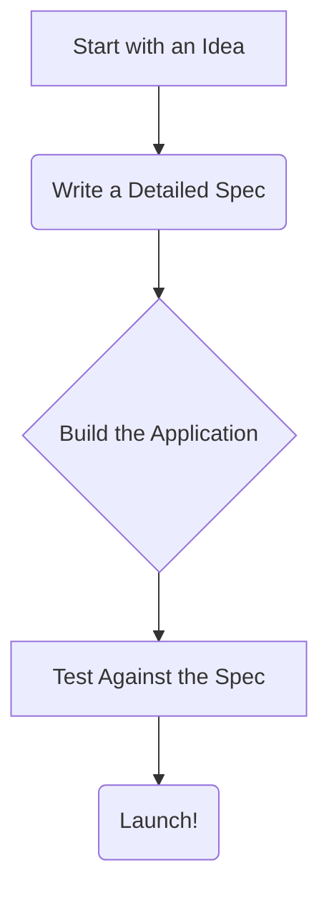
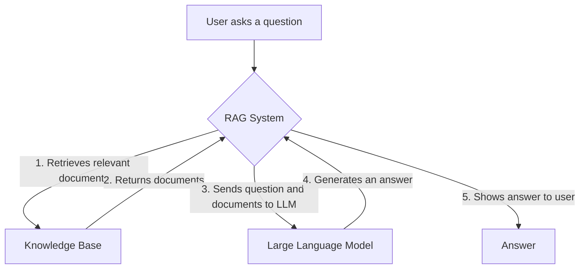

# Chapter 1: Let's Build an AI! (The Smart Way)

Welcome to your first step into the exciting world of building AI applications! If you've ever been curious about how AI works or how to build your own, you're in the right place. We're going to build an AI-powered textbook, and we'll do it using a powerful technique called **Spec-Driven Development**.

Don't worry if these terms sound complicated. We'll break everything down into simple, easy-to-understand concepts.

## What is Spec-Driven Development? (And Why You Should Care)

Imagine you're building a house. Would you start by just nailing some boards together? Probably not! You'd start with a **blueprint** (a "spec" or specification). This blueprint would show you what the house will look like, how many rooms it will have, and where everything goes.

Spec-Driven Development (SDD) is like creating a blueprint for your software *before* you write any code.

### A Simple Diagram of SDD

Here's a simple diagram that shows the process. We'll use a special syntax called MermaidJS, which Docusaurus understands and turns into a diagram.

### The Benefits of Using a "Blueprint"

-   **Everyone is on the same page:** The spec acts as a single source of truth for the entire team.
-   **Fewer surprises:** You can spot problems in your design *before* you've spent hours coding.
-   **Go faster:** With a clear plan, you can build with confidence.

:::tip
Think of the spec as a contract that you write with yourself. It's a promise to build the application in a certain way.
:::

## The "AI" in Our Project: What is RAG?

When people think of AI, they often think of super-smart robots from the movies. Our AI will be a bit more practical. We'll be using a technology called **Retrieval Augmented Generation (RAG)**.

At its core, RAG is a way to make a Large Language Model (LLM) like Gemini or ChatGPT smarter by giving it access to a specific set of information.

### How RAG Works

Imagine you have a friend who is an expert on a particular topic, say, "dinosaurs". If you ask your friend a question about dinosaurs, they can give you a very detailed and accurate answer.

RAG works in a similar way. We give our LLM a "knowledge base" (in our case, the content of our textbook). When a user asks a question, the RAG system does two things:

1.  **Retrieves** relevant information from the knowledge base.
2.  **Generates** an answer based on that information.

Here's a diagram of the process:

## Our Project: An AI-Powered Textbook

Throughout this book, we'll build a real, working AI application. Here's what you'll create:

*   **A beautiful textbook website:** Using a tool called Docusaurus, you'll build a website for our textbook.
*   **A "smart" search engine:** You'll build a RAG-based API that can answer questions about the textbook's content.
*   **Personalization features:** You'll learn how to create user accounts and tailor the experience to each user.

By the end of this journey, you'll not only have a cool project to show off, but you'll also have a solid understanding of how to build AI applications the "smart way" with Spec-Driven Development.

Ready to get started? Let's dive in!