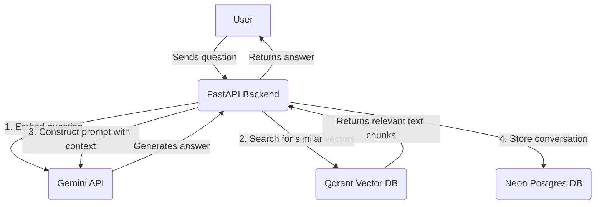

# Chapter 4: Building the RAG Chatbot

In the previous chapter, we meticulously crafted a specification for our `GeminiModel` client. Now, it's time to put that blueprint into action and build the core of our intelligent application: a Retrieval-Augmented Generation (RAG) chatbot. This chapter will guide you through the architecture and implementation of a chatbot that can answer questions based on a specific set of documents.

## The RAG Architecture

A RAG chatbot is a powerful combination of two concepts: information retrieval and text generation. Instead of relying solely on the vast, general knowledge of a large language model (LLM), a RAG system first *retrieves* relevant information from a private knowledge base and then uses that information to *generate* a precise, context-aware answer.

Our architecture will be composed of three key components:

1.  **FastAPI**: Our web backend, providing the API endpoints for our chatbot.
2.  **Qdrant**: Our vector database, which will store our documents and allow us to find relevant passages.
3.  **Neon**: Our serverless Postgres database, used for storing conversation history.

Here's a visual overview of how these components interact:



### 1. FastAPI: The API Backbone

[FastAPI](https://fastapi.tiangolo.com/) is a modern, high-performance web framework for building APIs with Python. It's incredibly fast, easy to use, and comes with automatic interactive documentation, which is perfect for our project. We'll use it to create an endpoint that accepts a user's question and returns a generated answer.

Here's a simplified example of what our main endpoint might look like:

```python
# main.py (FastAPI application)
from fastapi import FastAPI
from pydantic import BaseModel
from my_rag_logic import get_rag_answer

app = FastAPI()

class Query(BaseModel):
    question: str
    conversation_id: str | None = None

@app.post("/chat")
async def chat(query: Query):
    """
    Receives a question, retrieves relevant context,
    and returns a generated answer.
    """
    answer, new_conversation_id = await get_rag_answer(
        query.question, query.conversation_id
    )
    return {"answer": answer, "conversation_id": new_conversation_id}
```

### 2. Qdrant: The Knowledge Base

[Qdrant](https://qdrant.tech/) is a vector database. It's designed to store high-dimensional vectors (in our case, text embeddings) and find the closest matches for a given query vector. This is the "retrieval" part of RAG.

Our process will be:
1.  **Chunking:** Break our source documents (e.g., the chapters of this book) into smaller, manageable chunks.
2.  **Embedding:** Use a language model (like Gemini) to convert each text chunk into a numerical vector (an embedding).
3.  **Indexing:** Store these vectors in a Qdrant collection.

When a user asks a question, we'll embed their question into a vector and use Qdrant to find the text chunks with the most similar vectors. These chunks become the context for our answer.

### 3. Neon: The Conversation Memory

[Neon](https://neon.tech/) is a serverless, developer-friendly Postgres database. We'll use it to store the history of our conversations. Why is this important? It allows the chatbot to have "memory" and understand the context of a follow-up question.

For each question and answer, we'll store:
- A unique `conversation_id`.
- The user's question.
- The model's answer.
- A timestamp.

This allows us to rebuild the conversation history and provide it to the Gemini model, leading to more natural and coherent interactions.

## Selected-Text-Only Answer Mode

One of the challenges with LLMs is that they can sometimes "hallucinate" or provide information that isn't from the source material. To combat this, we'll implement a **"selected-text-only answer mode."**

This is a special instruction we give to the model in our prompt. We essentially tell it: **"Only use the information provided in the retrieved text to answer the question. If the answer is not in the text, say so."**

Here's how we can modify our prompt to the `GeminiModel` to enable this mode:

```python
# Part of our get_rag_answer logic
retrieved_chunks = qdrant_client.search(...) # Search Qdrant

context = "\n".join(chunk.text for chunk in retrieved_chunks)

prompt = f"""
You are a helpful assistant. A user has asked a question.
Using ONLY the following text, please answer the user's question.
Do not use any of your own knowledge. If the answer is not present in the text,
respond with "I could not find an answer in the provided text."

---
TEXT:
{context}
---

QUESTION:
{user_question}
"""

answer = gemini_model.call(prompt=prompt)
```

This technique forces the model to act as a pure question-answering system based on the context we provide, making our RAG chatbot more reliable and trustworthy.

## What's Next?

We've now designed the architecture for our RAG chatbot. We understand the role of each component and have a strategy for ensuring our answers are grounded in our source documents.

In the next chapter, we'll dive into the implementation details. We'll set up our project, write the code to chunk and embed our documents, and build the FastAPI application that ties everything together.
